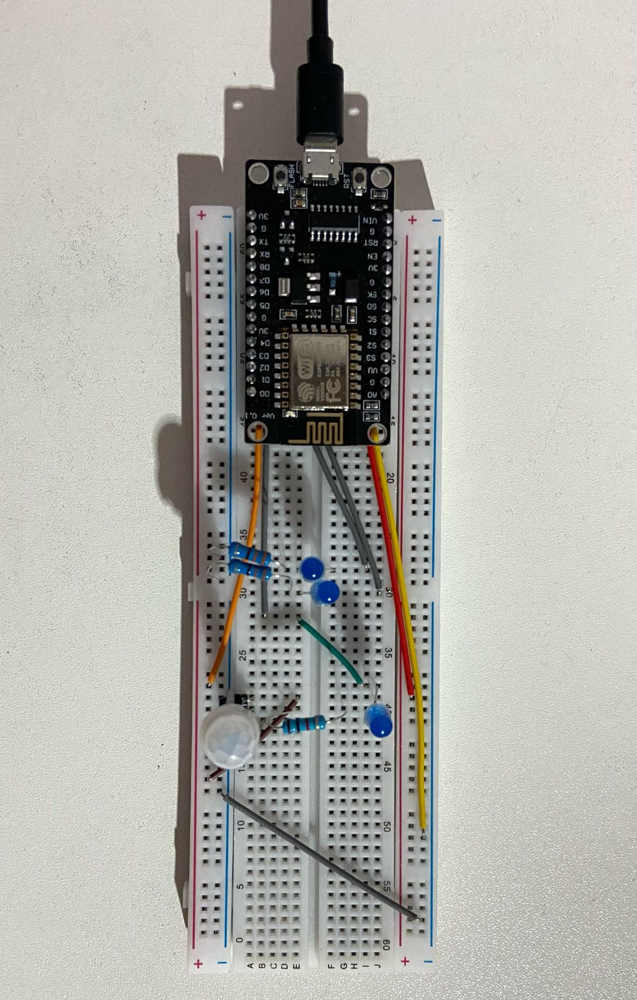
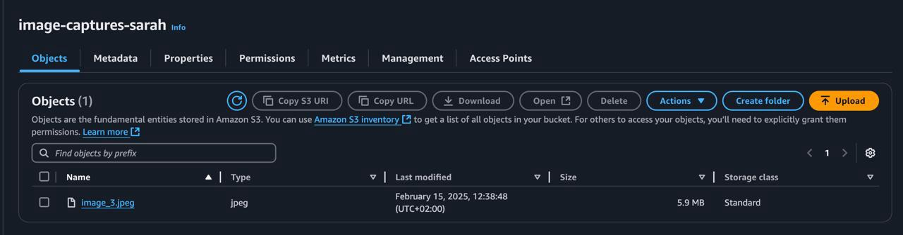

# ExplaVisionRTFD

## Overview

**ExplaVisionRTFD** is a smart system that integrates IoT with a server and cloud storage. It leverages an **ESP8266 microcontroller** and a **Node.js backend** to capture images upon detecting motion, upload them to **AWS S3**, and analyze them for future use.

## System Components

- **Node.js Server**: Handles image capture from a webcam and uploads images to AWS S3.
- **ESP8266 Microcontroller**: Monitors an IR sensor and triggers image capture upon motion detection.
- **AWS S3**: Stores captured images for further processing.

## Circuit Connection

The following image shows how the ESP8266 microcontroller is connected with the IR sensor:



## Requirements

Before running the project, ensure the following dependencies are installed.

### Node.js Server Requirements

- **Node.js and npm installed**
- Required npm packages:

```sh
npm install express fs path node-webcam node-fetch
```

### Microcontroller (ESP8266) Requirements

- **Arduino IDE installed**
- **ESP8266 board package installed in Arduino IDE**
- Required libraries:
  - `ESP8266WiFi.h`
  - `ESP8266HTTPClient.h`

## Setup and Execution

### 1. Setting Up the Node.js Server

Clone the repository:

```sh
git clone https://github.com/its-serah/ExplaVisionRTFD.git
cd ExplaVisionRTFD
```

Install dependencies:

```sh
npm install
```

Run the server:

```sh
node server.js
```

The server will start at [http://localhost:3000](http://localhost:3000).

### 2. Configuring the ESP8266 Microcontroller

1. Open **Arduino IDE**.
2. Install the necessary libraries (`ESP8266WiFi.h`, `ESP8266HTTPClient.h`).
3. Update the Wi-Fi credentials in the code:

```cpp
const char* ssid = "your-SSID";
const char* password = "your-password";
```

4. Upload the code to the ESP8266.
5. Open the **Serial Monitor** and ensure the device connects to Wi-Fi.

## How It Works

1. The **ESP8266** monitors an **IR sensor** for motion detection.
2. Upon detecting motion, the **ESP8266** sends an HTTP request to the `/capture` endpoint of the **Node.js server**.
3. The **server captures an image** using a connected webcam and saves it locally.
4. The **image is uploaded to an AWS S3 bucket**.
5. The **ESP8266 receives confirmation** of the successful upload and logs the response.

## Expected Output

Once motion is detected, an image is captured and uploaded to AWS S3. The following image demonstrates a successful capture:



## Troubleshooting

### **Node.js Server Issues**

- Ensure all dependencies are installed (`npm install`).
- Check if the webcam is correctly connected and accessible.
- If the image fails to upload, verify **AWS S3 credentials** and **permissions**.

### **ESP8266 Issues**

- If Wi-Fi does not connect, verify the **SSID and password**.
- Ensure the **API endpoint** in the code matches the **Node.js server’s address**.
- If the sensor does not detect motion, check **wiring and IR sensor functionality**.

## Contributions

Feel free to contribute by submitting **pull requests** or **reporting issues** in the repository.

## License

This project is licensed under the **MIT License**.
